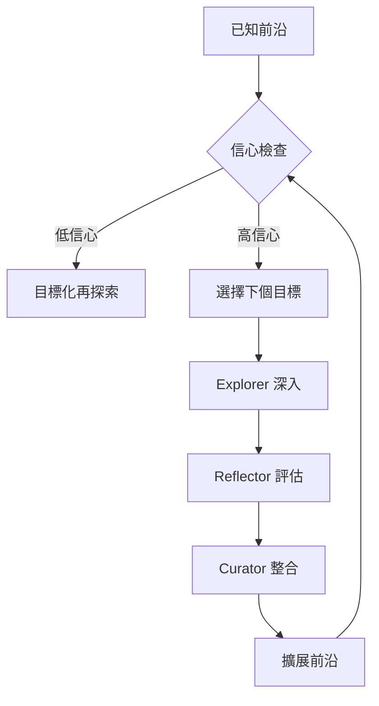

# Versa - 動態程式碼架構探索系統

一個使用前沿導向技術與 AI 代理協調的程式碼逆向工程系統。與傳統固定輪次的分析方法不同，Versa 使用動態前沿管理與信心驅動的探索策略。

## 概述

Versa 將傳統的 R0→R1→R2 固定輪次替換為動態探索框架：

- **🗺️ 前沿導向**：像探索未知領土一樣，系統性地對應未探索區域
- **🎯 信心驅動**：基於不確定性和重要性自動優先處理高效能探索區域
- **🤖 AI 代理協調**：Explorer(探索者)→Reflector(反思者)→Curator(策展人) 工作流程，實現品質保障
- **📊 記憶系統**：結構化知識累積，無上下文崩塌

## 核心架構

### 三代理角色

#### 🔍 **Explorer (探索代理)**
- 發現系統骨架：入口點、元件、邊界
- 對應結構連接和橫貫關注點
- 以結構化記憶格式記錄發現
- 識別前沿拓展機會

#### 🔎 **Reflector (品質保障代理)**
- 評估信心水準和證據強度
- 識別差距、不一致和假設
- 提供風險分析和驗證要求
- 推薦下個探索優先級

#### 🧠 **Curator (知識整合代理)**
- 將發現整合至系統整體理解
- 管理探索前沿和優先隊列
- 確保記憶一致性和關係追蹤
- 指導策略方向和階段轉移

## 運作方式

### 引導階段 (初始探索)


1. **Explorer** 發現系統邊界、入口點、主要元件
2. **Reflector** 評估品質並識別差距
3. **Curator** 建立探索前沿和優先目標

### 擴展階段 (迭代深化)


系統持續：
- 基於重要性×不確定性選擇最高價值未探索區域
- 使用適當深度探索目標區域
- 更新信心水準和前沿邊界
- 根據新發現的模式調整策略

## 開始探索

### 基本引導
```bash
/reverse-analyze --workflow bootstrap --repo .
```

這執行完整的代理協調循環以進行初始系統理解。

### 進階用法
```bash
/reverse-analyze --agent explorer --target "specific_module"
# 直接代理調用以進行目標化分析
```

## 記憶系統

### 結構化儲存格式
所有發現以 YAML 前言 Markdown 儲存以實現最佳人工-AI 協作：

```yaml
---
entry_id: "SKELETON_COMPONENT_USER_SERVICE_001"
timestamp: "2025-10-14T22:00:00Z"
agent: "explorer"
confidence: "high"
phase: "skeleton_discovery"
---

## 元件摘要
發現具有 JWT 驗證的使用者認證服務...

## 連接
- 從資料庫邊界接收資料
- 被 API 控制器呼叫
- 橫貫安全性中介層
```

### 記憶組織
```
specifications/memory/
├── sessions/           # 會話日誌與進度追蹤
├── elements/          # 個別發現
│   ├── skeleton/      # 系統結構元素
│   ├── component/     # 實作元件
│   ├── assessment/    # 品質評估
│   └── integration/   # 策展人合成
├── frontier/          # 當前探索狀態
│   ├── active_frontier.md
│   ├── confidence_heatmap.md
│   └── exploration_queue.md
└── schemas/           # 格式定義
```

## 探索策略

### 自動策略選擇
- **Bootstrap**：初始發現，當知識庫為空或極其稀疏時 (<5 個發現元素)
- **CoverageDriven**：填補差距，當整體信心分佈高度不均時 (<60% 平均信心)
- **PriorityBased**：專注高重要性區域，當特定元件需要深入理解或具有高商業價值時
- **RiskFocused**：解決安全性關鍵或高風險區域，當存在系統失敗風險時

### 適應性深度控制
- **Shallow**：邊界對應和介面發現
- **Medium**：元件關係和資料流
- **Deep**：實作細節和合約驗證

## 命令參考

### 核心命令

```bash
# 為新程式碼庫進行啟動分析
/reverse-analyze --workflow bootstrap

# 從前沿狀態繼續探索
/reverse-analyze --workflow expand

# 直接代理調用
/reverse-analyze --agent explorer --target "api/routes.go"
/reverse-analyze --agent reflector --target "USER_SERVICE_001"
/reverse-analyze --agent curator --action "integrate_session"

# 從儲存狀態恢復探索
/reverse-analyze --resume "specifications/memory/frontier/active_frontier.md"
```

### 進階參數

| 參數 | 描述 | 預設 | 範例 |
|------|------|------|------|
| `--workflow` | 完整工作流程 | auto | `--workflow bootstrap` |
| `--agent` | 特定代理角色 | auto | `--agent explorer` |
| `--target` | 焦點目標 | auto | `--target "auth_service"` |
| `--strategy` | 探索策略 | auto | `--strategy RiskFocused` |
| `--depth` | 分析深度 | adaptive | `--depth medium` |
| `--resume` | 從狀態繼續 | - | `--resume "path/to/state.md"` |
| `--confidence-threshold` | 最小信心篩選 | 0.6 | `--confidence-threshold 0.8` |

## 品質保障框架

### 信心評分
- **高 (0.8-1.0)**：強證據、多來源、架構上合理
- **中 (0.5-0.7)**：合理證據、有差距、可信結論
- **低 (0.0-0.4)**：弱證據、重大假設、需要驗證

### 品質指標
- **覆蓋率**：程式碼庫元素理解百分比
- **信心**：關鍵路徑平均信心
- **一致性**：相關發現間的一致性
- **前沿清晰度**：已知與未知的清晰區別

## 相對於傳統輪次制系統的優勢

### 🚀 **靈活性**
- **動態深度**：根據需求調整探索水準，非固定輪次
- **適應策略**：基於系統模式自動切換方法
- **人工參與**：關鍵決策可加入人工專長

### 🎯 **效率**
- **智慧焦點**：自動優先處理高價值區域
- **記憶重用**：在先前發現之上建構，無需重新探索
- **信心優化**：避免過度分析已充分理解的區域

### 🧠 **品質**
- **持續驗證**：進行中的品質評估，非最終輪次
- **差距感知**：系統性地識別和填補知識空隙
- **一致性追蹤**：跨驗證相關發現

### 📈 **人性化**
- **早期成果**：及早提供有用的洞見，而非一次性交付
- **可解釋流程**：探索決策的清晰理由
- **協作**：人工專家可指導、覆寫並貢獻

## 使用情境

### ✅ **使用 Versa 的時機**

- 理解複雜的舊程式碼庫，具有不清楚的架構
- 新團隊成員的程式碼庫知識漸進建構
- 評估提案變更在關鍵系統中的風險
- 需要完整系統理解的文件專案
- 現代化規劃需要系統全面掌握

### ❌ **不適合使用的情境**

- 明顯結構的簡單程式碼庫 (使用基本工具)
- 時間緊急的除錯 (使用除錯工具)
- 效能優化 (使用效能分析工具)
- 安全性稽核 (使用專門安全性工具)

## 發現的架構模式

系統特別擅長辨識：

### ✅ **良好偵測模式**
- **分層架構**：明確的關注點分離
- **MVC 模式**：控制器/服務/儲存庫結構
- **微服務**：服務邊界和通訊模式
- **事件驅動**：訊息流和事件處理

### ⚠️ **需要注意的模式**
- **大泥球**：結構不清晰、連接鬆散的整體
- **分散橫貫**：無清晰邊界的持續關注點
- **混合典範**：不一致的架構模式
- **高耦合**：造成改變風險的緊密互連

## 組態設定

### .clinerules 整合
系統與 Cline 的 `.clinerules` 組態整合：

```ini
[frontier-system]
dynamic_phase_transitions = true
agent_coordination = true
memory_driven_decisions = true

[strategies]
exploration_strategies = ["Bootstrap", "CoverageDriven", "PriorityBased", "RiskFocused"]
```

### 輸出結構演進
```
specifications/
├── memory/              # 增量知識庫
│   ├── sessions/        # 階段記錄
│   ├── elements/        # 元件知識
│   └── frontier/        # 探索狀態
├── analysis/            # 衍生洞察
│   ├── architecture_overview.md
│   ├── confidence_assessment.md
│   └── exploration_log.md
└── deliverables/         # 最終輸出 (就緒時)
    ├── system_architecture.md
    └── recommendations.md
```

## 入門指南

1. **安裝**：無需額外工具 (使用現有 CLI 工具)
2. **組態**：在專案根目錄放置 `.clinerules`
3. **引導**：`/reverse-analyze --workflow bootstrap`
4. **探索**：讓代理指導系統性發現
5. **文件化**：使用累積知識進行專案需求

## 哲學理念

> **"智慧探索、增量記錄、深刻理解"**

Versa 將程式碼理解從文件練習轉變為系統性探索問題。透過維護清楚的已知-未知邊界、保留信心水準，並實現人工-AI 協作，它提供了一個在維護人工洞察和控制的同時適應複雜系統複雜度的框架。

---

**準備開始了嗎？**

```bash
/reverse-analyze --workflow bootstrap --repo .
