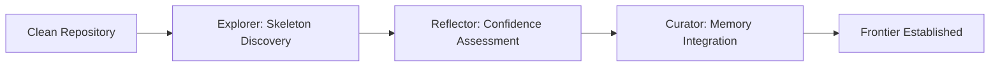
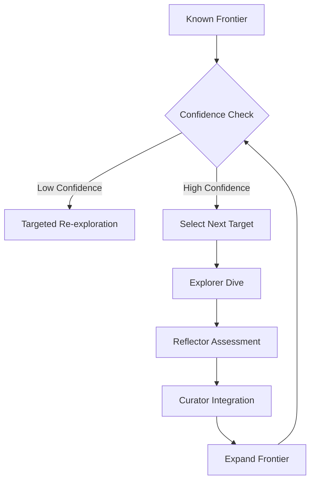

# Versa - Dynamic Code Architecture Exploration

A Frontier-Based reverse engineering system that incrementally explores codebases through AI agent coordination. Unlike traditional fixed-round approaches, Versa uses confidence-driven exploration with intelligent frontier management.

## Overview

Versa replaces rigid R0→R1→R2 rounds with a dynamic exploration framework:

- **🗺️ Frontier-Based**: Like exploring an unknown territory, systematically mapping unexplored regions
- **🎯 Confidence-Driven**: Prioritizing high-value, low-confidence areas for maximum insight efficiency
- **🤖 Agent Coordination**: Explorer→Reflector→Curator workflow with incremental memory building
- **📊 Memory System**: Structured knowledge accumulation without context collapse

## Core Architecture

### Three Agent Roles

#### 🔍 **Explorer** (Discovery Agent)
- Discovers system skeleton: entrypoints, components, boundaries
- Maps structural connections and cross-cutting concerns
- Records findings in structured memory format
- Identifies frontier expansion opportunities

#### 🔎 **Reflector** (Quality Assurance Agent)
- Assesses confidence levels and evidence strength
- Identifies gaps, inconsistencies, and assumptions
- Provides risk analysis and validation requirements
- Recommends next exploration priorities

#### 🧠 **Curator** (Knowledge Integration Agent)
- Integrates findings into coherent system understanding
- Manages exploration frontier and priority queues
- Ensures memory consistency and relationship tracking
- Guides strategic direction and phase transitions

## How It Works

### Bootstrap Phase (Initial Exploration)


1. **Explorer** discovers system boundaries, entrypoints, major components
2. **Reflector** evaluates quality and identifies gaps
3. **Curator** establishes exploration frontier and priority targets

### Expansion Phase (Iterative Deepening)


System continuously:
- Selects highest-value unexplored regions based on importance × uncertainty
- Explores targeted areas with appropriate depth
- Updates confidence levels and frontier boundaries
- Adapts strategy based on emerging patterns

## Starting Exploration

### Basic Bootstrap
```
/reverse-analyze --workflow bootstrap --repo .
```

This performs the complete agent coordination cycle for initial system understanding.

### Advanced Usage
```
/reverse-analyze --agent explorer --target "specific_module"
# Direct agent invocation for targeted analysis
```

## Memory System

### Structured Storage Format
All findings stored in YAML-frontmatter Markdown for optimal human-AI collaboration:

```yaml
---
entry_id: "SKELETON_COMPONENT_USER_SERVICE_001"
timestamp: "2025-10-14T22:00:00Z"
agent: "explorer"
confidence: "high"
phase: "skeleton_discovery"
---

## Component Summary
Discovered user authentication service with JWT validation...

## Connections
- Connects to: Database boundary
- Called by: API controllers
- Cross-cuts: Security middleware
```

### Memory Organization
```
specifications/memory/
├── sessions/           # Exploration session logs
├── elements/          # Individual findings
│   ├── skeleton/      # Structural elements
│   ├── component/     # Implementation components
│   ├── assessment/    # Quality evaluations
│   └── integration/   # Synthesized knowledge
├── frontier/          # Current exploration state
│   ├── active_frontier.md
│   ├── confidence_heatmap.md
│   └── exploration_queue.md
└── schemas/           # Format definitions
```

## Exploration Strategies

### Automatic Strategy Selection
- **Bootstrap**: Initial discovery when knowledge is sparse
- **Coverage**: Fill understanding gaps when confidence distribution is uneven
- **Priority**: Focus on high-importance areas with clear value propositions
- **Risk**: Address high-risk components that could cause system failures

### Adaptive Depth Control
- **Shallow**: Boundary mapping and interface discovery
- **Medium**: Component relationships and data flows
- **Deep**: Implementation details and contract verification

## Command Reference

### Core Commands

```bash
# Bootstrap new repository exploration
/reverse-analyze --workflow bootstrap

# Continue exploration with frontier management
/reverse-analyze --workflow expand

# Direct agent invocation
/reverse-analyze --agent explorer --target "api/routes.go"
/reverse-analyze --agent reflector --target "USER_SERVICE_001"
/reverse-analyze --agent curator --action "integrate_session"

# Resume interrupted exploration
/reverse-analyze --resume "specifications/memory/frontier/active_frontier.md"
```

### Advanced Parameters

| Parameter | Description | Default | Example |
|-----------|-------------|---------|---------|
| `--workflow` | Complete workflows | auto | `--workflow bootstrap` |
| `--agent` | Specific agent role | auto | `--agent explorer` |
| `--target` | Focus target | auto | `--target "auth_service"` |
| `--strategy` | Exploration strategy | auto | `--strategy RiskFocused` |
| `--depth` | Analysis depth | adaptive | `--depth medium` |
| `--resume` | Continue from state | - | `--resume "path/to/state.md"` |
| `--confidence-threshold` | Min confidence filter | 0.6 | `--confidence-threshold 0.8` |

## Quality Assurance Framework

### Confidence Scoring
- **High (0.8-1.0)**: Strong evidence, multiple sources, architecturally sound
- **Medium (0.5-0.7)**: Reasonable evidence, some gaps, plausible conclusions
- **Low (0.0-0.4)**: Weak evidence, significant assumptions, needs verification

### Quality Metrics
- **Coverage**: Percentage of codebase elements understood
- **Confidence**: Average confidence across critical paths
- **Consistency**: Agreement between related findings
- **Frontier Clarity**: Clear distinction between known and unknown

## Benefits Over Traditional Round-Based Systems

### 🚀 **Flexibility**
- **Dynamic Depth**: Adjust exploration level based on needs, not fixed rounds
- **Adaptive Strategy**: Switch approaches based on emerging system patterns
- **Human-in-Loop**: Critical decisions can involve human expertise

### 🎯 **Efficiency**
- **Intelligence Focus**: Prioritize high-value areas automatically
- **Memory Reuse**: Build upon previous findings without re-exploration
- **Confidence Optimization**: Avoid over-analyzing well-understood areas

### 🧠 **Quality**
- **Continuous Validation**: Ongoing quality assessment, not just final rounds
- **Gap Awareness**: Systematic identification and filling of knowledge holes
- **Consistency Tracking**: Cross-validation of related discoveries

### 📈 **Human-Friendly**
- **Incremental Results**: Deliver useful insights early and often
- **Explainable Process**: Clear rationale for exploration decisions
- **Collaborative**: Human experts can guide, override, and contribute

## Use Cases

### ✅ **When to Use Versa**

- Understanding complex legacy codebases with unclear architecture
- Onboarding new team members with targeted knowledge building
- Risk assessment for proposed changes in critical systems
- Documentation projects requiring systematic code comprehension
- Modernization planning needing complete system understanding

### ❌ **When NOT to Use**

- Simple codebases with obvious structure (use basic tools)
- Time-critical debugging (use debugging tools)
- Performance optimization (use profiling tools)
- Security audits (use specialized security tools)

## Architecture Patterns Discovered

The system is particularly effective at recognizing:

### ✅ **Well Detected**
- **Layered Architecture**: Clear separation of concerns
- **MVC Patterns**: Controller/service/repository structures
- **Microservices**: Service boundaries and communication patterns
- **Event-Driven**: Message flows and event handling

### ⚠️ **Requires Attention**
- **Big Ball of Mud**: Monolithic structures with unclear boundaries
- **Scattered Cross-Cutting**: Pervasive concerns without clear boundaries
- **Mixed Paradigms**: Inconsistent architectural patterns
- **High Coupling**: Tight interconnections creating change risk

## Configuration

### .clinerules Integration
The system integrates with Cline's `.clinerules` configuration:

```ini
[frontier-system]
dynamic_phase_transitions = true
agent_coordination = true
memory_driven_decisions = true

[strategies]
exploration_strategies = ["Bootstrap", "CoverageDriven", "PriorityBased", "RiskFocused"]
```

### Output Structure Evolution
```
specifications/
├── memory/              # Incremental knowledge base
│   ├── sessions/        # Phase records
│   ├── elements/        # Component knowledge
│   └── frontier/        # Exploration state
├── analysis/            # Derived insights
│   ├── architecture_overview.md
│   ├── confidence_assessment.md
│   └── exploration_log.md
└── deliverables/         # Final outputs when ready
    ├── system_architecture.md
    └── recommendations.md
```

## Getting Started

1. **Install**: No additional tools required (uses existing CLI tools)
2. **Configure**: Drop `.clinerules` in your project root
3. **Bootstrap**: `/reverse-analyze --workflow bootstrap`
4. **Explore**: Let the agents guide systematic discovery
5. **Document**: Use accumulated knowledge for your project needs

## Philosophy

> **"Explore intelligently, document incrementally, understand deeply"**

Versa treats codebase understanding as a systematic exploration problem rather than a documentation exercise. By maintaining clear frontiers between known and unknown territory, preserving confidence levels, and enabling strategic human-AI collaboration, it provides a framework for truly mastering complex systems.

---

**Ready to start?**

```
/reverse-analyze --workflow bootstrap --repo .
